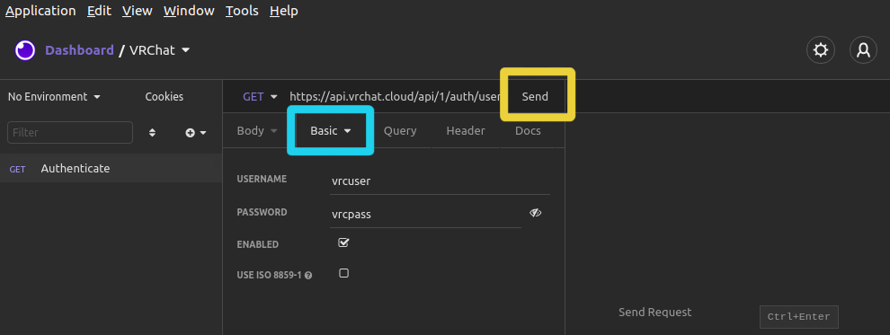
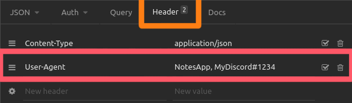
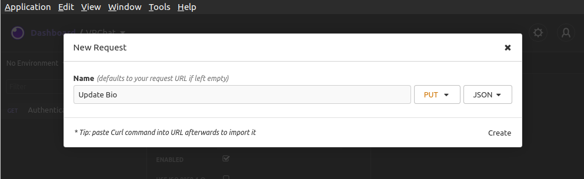
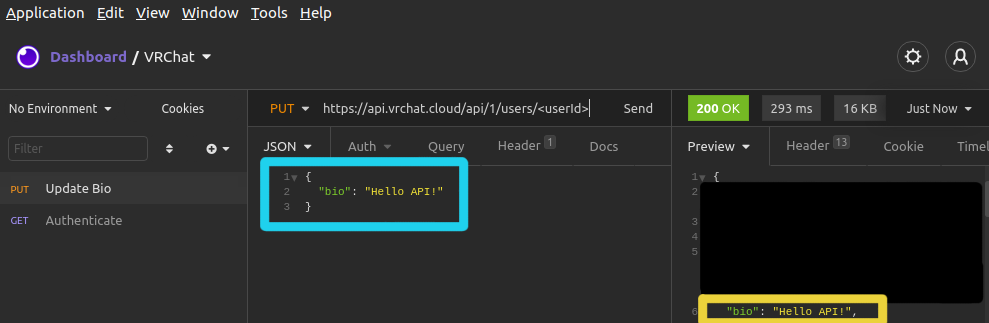

# Examples

## Updating your bio with curl

For updating our own social status we will be using the [Update User Info](/UserAPI/UpdateInfo) endpoint, which is a "PUT request". HTTP has various method types to indicate the intent of the request. The ones used with VRChat are as following:

* **GET** - For fetching information
* **POST** - For submitting **new** information
* **PUT** - For updating existing information
* **DELETE** - For deleting the targeted resource

GET requests does not have a message body, and can only carry arguments as parameters. This means arguments such as userId or search parameters are provided inside the URL.

```
https://example.com/some/path/<userId>?searchName=<serach>&condensed=true
```

POST and PUT requests carry a JSON-encoded message body, except for file-uploads which instead uses `multipart/form-data`.
As we in this case will send a PUT request we have to encode it as a JSON payload.

In this case we will use curl to send a "PUT" request to *update* your bio. In the following command we begin with specifying `-b cookiejar.txt` to use the authentication cookies aquired previously [during Authentication](/GettingStarted/QuickStart?id=authorization), `-X PUT` to make it a PUT request, `-A "My User Agent` to ethically identify yourself (this is needed for the firewall, give your app a unique agent name), `-H "Content-Type: application/json'` to tell the API we are sending a JSON payload, `-d '{"bio":"Hello API!"}'` which is the JSON payload itself, and finally the target URL to `api.vrchat.cloud`.

```bash
curl -b cookiejar.txt -X PUT -A "My User Agent" -H "Content-Type: application/json" -d '{"bio":"Hello API!"}' https://api.vrchat.cloud/api/1/users/<userId>
```

After successful query you should get an entire [`Current User object`](/Objects/User.md#current-user-object) back. This is a large JSON object representing the state of your entire account. By looking through this data we can see - close to the top - your bio has changed to "Hello API".

## Updating your bio with Insomnia

This tutorial asumes you already have [Insomnia](https://insomnia.rest/download) downloaded and installed. We will begin with creating a new "Request Collection" and name it "VRChat".


We will now create our first Request in order to authenticate with the API. Click "New Request" (cyan rectangle) and name it "Authenticate". We will let it be of type GET and click Create.


Select `Basic > "Basic Auth"` and enter your VRChat username and password. The target URL should be set to `https://api.vrchat.cloud/api/1/auth/user` and click Send.



!> **Ethical practice!** Make sure to always set a custom `User-Agent` under Headers, to properly identify your requests.  <!-- Intentional two spaces for newlines -->
Good-practice is to set a short unique name for your application, as well as a contact method such as Discord.  <!-- Intentional two spaces for newlines -->


If successful then we should have gotten 3 new cookies, as indicated by the cyan rectangle below. In the future you can click "Cookies" **top-left** (pink rectangle) to see your cookies. We can also see in the response body our **userId** (yellow rectangle), it is important to keep this as we will need it for the next request.


Next we will create our second Request to update our Biography, click "New Request" indicated by the purple rectangle. We will name this one "Update Bio", we will set it to method type **PUT** and of body type **JSON**:



Set the `User-Agent` again, although this time it is **important NOT to** set Auth again. Entering your username/password again will make you constantly request new session tokens, depleting your pool of available sessions and getting you rate-limited until the previous ones expire. Instead we will automatically authenticate with the cookies aquired in the previous Authentication request.

To finally update the Bio we set the URL to `https://api.vrchat.cloud/api/1/users/<userId>` where `<userId>` is **your** userId found in the previous request, and the message body set to the following:

```json
{
	"bio": "Hello API!"
}
```

Click "Send" and we can see in the bottom right the Bio has now been updated to the new text:



?> **Congratulations!** You have now ready to explore the API. Please keep in mind the strict rate-limit, and that any abuse can lead to permanent account termination.

See [`Current User object`](/Objects/User.md#current-user-object) for a full list of values possible to set. Note some values such as `date_joined`, `last_login` and `friends` are either system-generated and not possible to change, or values which you change through other endpoints (such as adding friends through the Friends API).